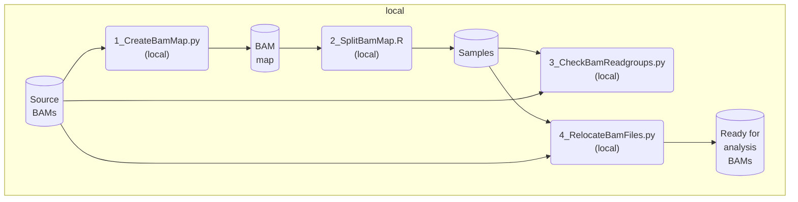
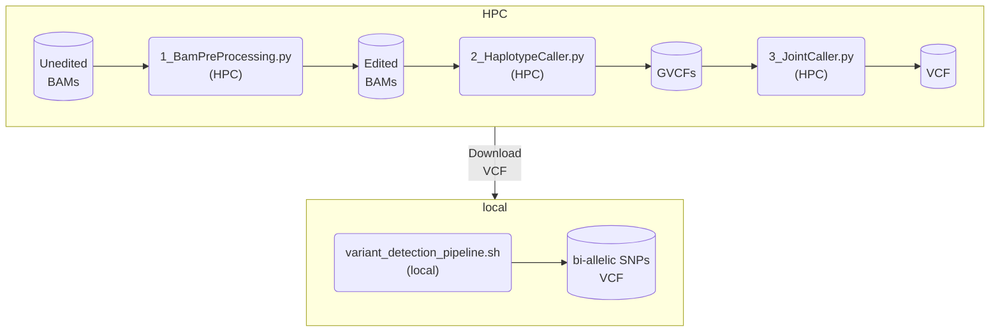
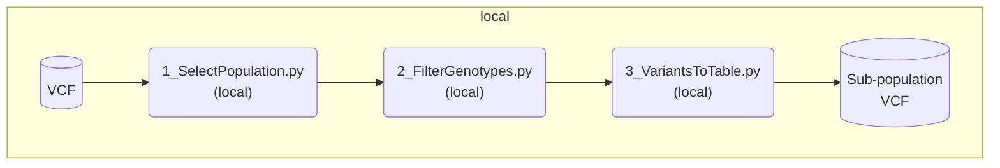
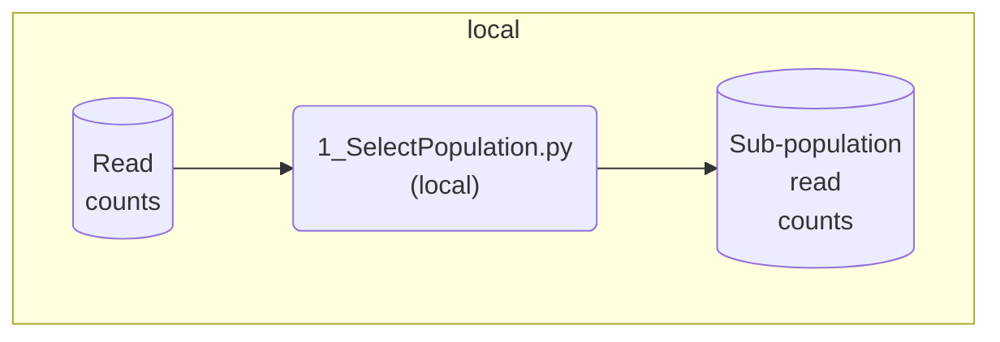
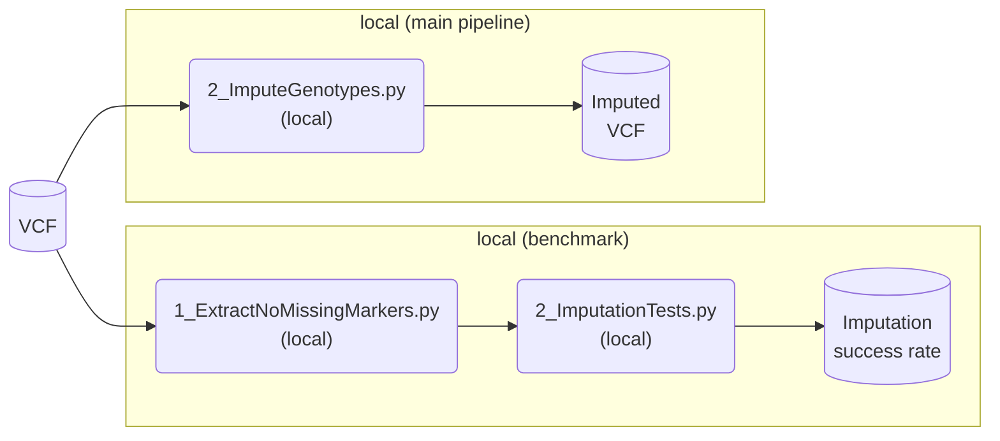
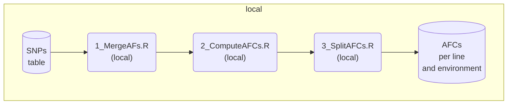
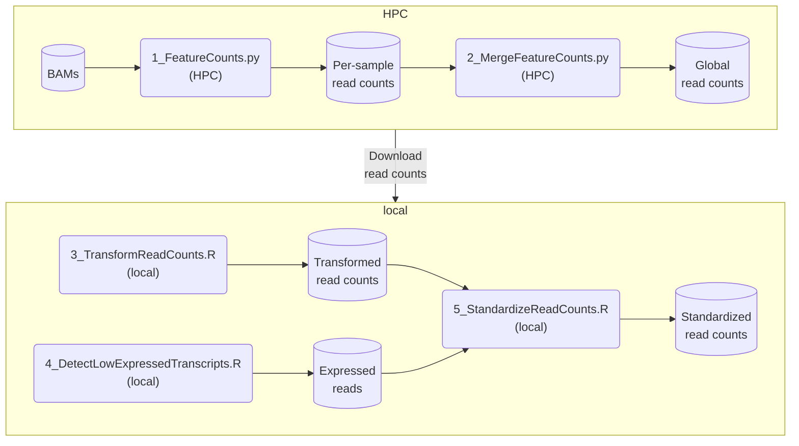
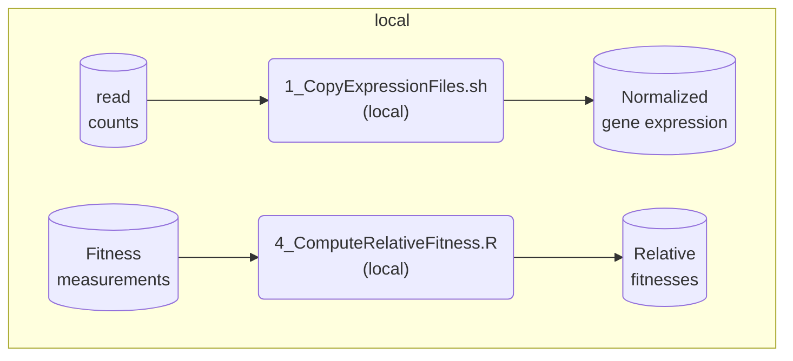
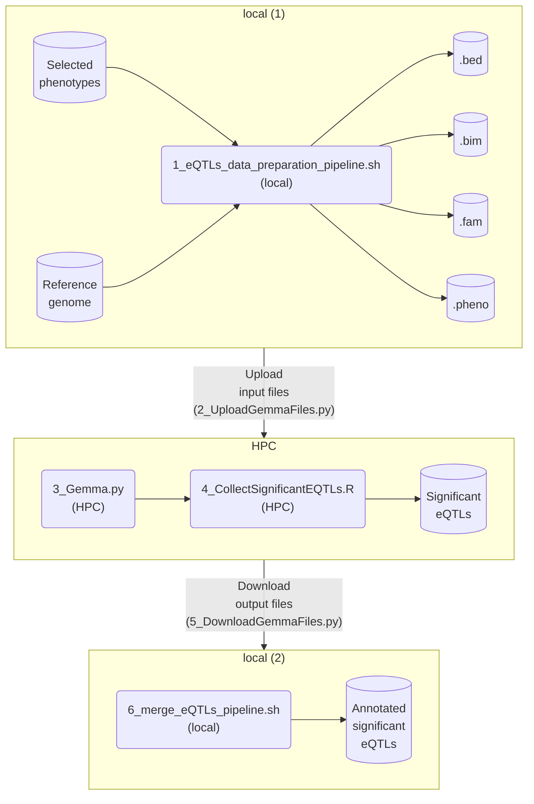

<h1 align="center"><em>Tribolium castaneum</em> transcriptomics pipeline developed for Koch et al. manuscript "<em>Gene expression evolution is predictable and driven by indirect selection pressures</em>"</h1>

 

This repository contains the complete transcriptomics pipeline, as well as post-analysis scripts, developed for Koch et al. manuscript "<em>Gene expression evolution is predictable and driven by indirect selection pressures</em>". The pipeline addresses various facets of the transcriptomics data obtained from the _Tribolium castaneum_ laboratory adaptive experiment published in [Koch & Guillaume (2020a)](https://doi.org/10.1371/journal.pgen.1008768), [Koch & Guillaume (2020b)](https://doi.org/10.1111/mec.15607) and [Koch et al. (2020)](https://doi.org/10.1111/evo.14119).

The pipeline was first designed to be deployed on the [CSC computing farm](https://www.csc.fi/en/). **For this reason, parts of the code have been anonymized** (<em>e.g.</em> to connect to the CSC servers).

# Table of contents
- [Authors](#authors)
- [Usage](#usage)
- [Overview](#overview)
- [Dependencies](#dependencies)
- [Description of the pipeline](#pipeline_description)
  - [Scripts](#scripts)
    - [Reorganizing BAM files](#scripts_1)
    - [Variants detection](#scripts_2)
    - [Selecting populations](#scripts_3)
    - [Genotype imputation](#scripts_4)
    - [Allelic frequency changes (AFCs)](#scripts_5)
    - [Preparing read counts](#scripts_6)
    - [Preparing phenotypes](#scripts_7)
    - [eQTLs](#scripts_8)
  - [Analyses](#analyses)
  - [Data](#data)
- [Copyright](#copyright)
- [License](#license)

# Authors 

- Charles Rocabert
- Eva L. Koch
- Frédéric Guillaume

# Usage

First, download the latest version of this repository on your local computer ([here](https://github.com/charlesrocabert/Koch-et-al-Gene-expression-evolution-is-predictable-and-driven-by-indirect-selection-pressures/archive/refs/heads/main.zip)).
Second, download the `data` folder from [???] and include it to the repository. The repository must be organized as following:

      ├── scripts
      ├── analyses
      ├── data
      └── README.md

# Overview

# Dependencies 

### • Software:
- PLINK 2.0,
- GATK-4.2.3.0,
- samtools 1.14
- picard-toolkit
- bcftools-1.14
- snpEff-5.1
- Beagle-5.4
- subread-2.0.3
- GEMMA-0.98.5

### • Programming languages:
- Python3+
- R
- shell

### • R-packages
- tidyverse
- cowplot
- edgeR
- limma
- ggfortify
- tibble
- WGCNA

### • Python libraries
- swiftclient
- paramiko

# Description of the pipeline 

      ├── scripts
      ├── analyses
      ├── data
      └── README.md

The pipeline is splitted in three main folders:
- `scripts`: This folder contains all the specific -omics tasks to build the data that will be used for higher-level analyses. This includes _e.g._ variants detection, eQTLs analysis, calculation of AFCs, etc.
- `analyses`: This folder contains higher-level analyses.
- `data`: This folder contains all the data produced by the pipeline. This folder is **not included** in the repository as it is too large to be handled by Github. It must be dowloaded separately.

## Scripts 

      └── scripts
           ├── 1_BAM_files_reorganization
           ├── 2_variant_call
           ├── 3_select_population
           ├── 4_genotype_imputation
           ├── 5_AFCs
           ├── 6_read_counts
           ├── 7_phenotypes
           └── 8_eQTLs

Transcriptomics tasks are separated into folders and numbered for clarity.
For each task, the scripts are also numbered in the order of their execution, and are split between local (`local` folder) and HPC (`hpc` folder).

Sometimes, a shell script is also available to run all **local scripts** in the right order (see below). HPC scripts are designed for the CSC computing farm. The user must update the code before deployment on a computer farm.

### 📂 Reorganizing BAM files 

      └── scripts
           └── 1_BAM_files_reorganization
                └── local
                     ├── 1_CreateBamMap.py
                     ├── 2_SplitBamMap.R
                     ├── 3_CheckBamReadgroups.py
                     └── 4_RelocateBamFiles.py

The objective here is to parse the original BAM files source, re-organize them, make some adjustements and extract information.

Associated data folder(s): `./data/tribolium_bam`.

#### ⚙️ `1_CreateBamMap.py (local)`:
> This script parses the original BAM files folder and extract the information in the form of a table `./data/tribolium_bam/bam_map.csv`.

#### ⚙️ `2_SplitBamMap.R (local)`:
> This script splits the file `bam_map.csv` into many sample subsets, depending on the reference genome, the environment, the line or the generation. All files are stored in `./data/tribolium_bam` folder.
**Sample files will be used all along the pipeline**.

#### ⚙️ `3_CheckBamReadgroups.py (local)`:
> This script parses every BAM files to check the absence of the "read group" entry ("RG" label).

#### ⚙️ `4_RelocateBamFiles.py (local)`:
> This script relocates BAM files from the original hard-drive for further analysis.
> **Ultimately, BAM files are transfered to a distant server with an independent script**.

### 📂 Variants detection 

      └── scripts
           └── 2_variant_call
                └── hpc
                     ├── 1_BamPreProcessing.py
                     ├── 2_HaplotypeCaller.py
                     └── 3_JointCaller.py
                └── local
                     └── 4_SelectFilterAnnotateVariants.py
                └── variant_detection_pipeline.sh

This task performs a variant call on the entire transcriptomic data (version Tcas3.30 of <em>T. castaneum</em> genome). It uses various software and ultimately produces a filtered VCF file containing raw SNPs.
This raw SNPs VCF file is stored in `./data/tribolium_vcf/Tribolium_castaneum_ALL_Tcas3.30.vcf.gz`.

Associated data folder(s): `./data/tribolium_vcf`.

#### ⚙️ `1_BamPreProcessing.py` (HPC):
> This script pre-processes BAM files by (in this order):
> - Importing the unedited BAM file from the distant server,
> - Importing the reference genome and generate indices,
> - Adding the read group,
> - Uncompressing the BAM file to SAM,
> - Editing the SAM file to recalibrate MAPQ values (255 --> 60),
> - Compressing edited SAM file to BAM,
> - Copying a version of the BAM file to mark duplicates,
> - Generating BAI index file,
> - Handling splicing events,
> - Exporting edited BAM files to the distant server.

#### ⚙️ `2_HaplotypeCaller.py` (HPC):
> This script uses marked duplicates BAM files to run the complete pipeline for per-sample variant call by (in this order):
> - Importing the BAM file from the distant server,
> - Importing the reference genome and generate indexes,
> - Generating BAI index file,
> - Running GATK HaplotypeCaller. **This task can take several hours**,
> - Exporting GVCF files to the distant server.

#### ⚙️ `3_JointCaller.py` (HPC):
> This script runs the complete pipeline for the join call by (in this order):
> - Generating GenomicsDB database by:
>   - Importing the list of samples,
>   - Importing all GVCFs from the distant server,
>   - Importing the reference genome from the distant server and compute index files,
>   - Generating the sample map,
>   - Generating the interval list,
>   - Running GATK GenomicsDBImport,
>   - Exporting the database to the scratch.
> - Performing the joint-call cohort by:
>   - Importing the consolidated database from the scratch if needed,
>   - Running GATK GenotypeGVCFs,
>   - Exporting the joint-call file (VCF) to a local server.

#### ⚙️ `4_SelectFilterAnnotateVariants.py` (local):
> This script selects bi-allelic SNP variants from the original VCF file by (in this order):
> 
> - Selecting bi-allelic SNP variants,
> - Tagging `DP=0` genotypes as missing (`./.`),
> - Filtering out low quality SNPs,
> - Annotating SNPs,
> - Adding SNP unique identifiers.

**➡️ Local script to run with the shell script `variant_detection_pipeline.sh`**.

### 📂 Selecting populations 

      └── scripts
           └── 3_select_population
                └── local
                     ├── 1_SelectPopulation.py
                     ├── 2_FilterGenotypes.py
                     └── 3_VariantsToTable.py
                ├── VCF_ALL_Beagle_pipeline.sh
                ├── VCF_CT_G1_eQTL_imputed_pipeline.sh
                ├── VCF_HD_G1_eQTL_imputed_pipeline.sh
                ├── VCF_imputed_genotypes_line_separation_pipeline.sh
                └── VCF_CT_HD_G1_LepMAP3_pipeline.sh

This task is a general function which splits population-level files (VCF or read counts) into sub-population files on user request.
**This function is used in further tasks involving sub-population analyses**.

Associated data folder(s): `./data/tribolium_snp`, `./data/tribolium_counts`.

#### ⚙️ `1_SelectPopulation.py` (local):
> This script selects a sub-population of samples based on a sample list (see section [3.1.1](#scripts_1")) by selecting the subset of samples in a VCF file or a read counts file.

#### ⚙️ `2_FilterGenotypes.py` (local):
> This script filters SNPs based on genotype coverage by (in this order):
> - Filtering genotypes based on F_MISSING,
> - Removing non-variant SNPs,
> - Removing LOWQUAL SNPs.

#### ⚙️ `3_VariantsToTable.py` (local):
> This script extracts VCF statistics into a text table.

**➡️ 5 pipelines are available for the selection of VCF sub-populations:**
- `VCF_ALL_Beagle_pipeline.sh`: Select ALL genotypes for Beagle imputation pipeline,
- `VCF_CT_G1_eQTL_imputed_pipeline.sh`: Select CT-G1 imputed genotypes for the eQTLs analysis,
- `VCF_HD_G1_eQTL_imputed_pipeline.sh`: Select HD-G1 imputed genotypes for the eQTLs analysis,
- `VCF_imputed_genotypes_line_separation_pipeline.sh`: Separate imputed genotypes into lines and generations for the AFC pipeline,
- `VCF_CT_HD_G1_LepMAP3_pipeline.sh`: Select CT/HD-G1 genotypes for the lep-MAP3 pipeline.

**OR**

### 📂 Genotype imputation 

      └── scripts
           └── 4_genotype_imputation
                └── local
                     ├── 1_ExtractNoMissingMarkers.py
                     ├── 2_ImputationTests.py
                     └── 3_ImputeGenotypes.py
                └── VCF_ALL_imputation_pipeline.sh

This task imputes missing genotypes on the global VCF file (including all samples) using Beagle software.
It is also possible to run a test to evaluate the quality of genotype imputations.

Associated data folder(s): `./data/tribolium_snp`.

#### ⚙️ `1_ExtractNoMissingMarkers.py` (local):
> This script extracts from the raw VCF file all the markers with a 100% call rate (_i.e_ without missing genotypes).
> The dataset is saved in binary format in `./data/tribolium_snp/imputation_tests`.
> 
#### ⚙️ `2_ImputationTests.py` (local):
> This script tests imputation capabilities of Beagle with toy datasets.
> Test results are saved in `./data/tribolium_snp/imputation_tests`.

#### ⚙️ `3_ImputeGenotypes.py` (local):
> Imputes genotypes of the VCF file with Beagle.

**➡️ Local script to run with the shell script `VCF_ALL_imputation_pipeline.sh`**.

### 📂 Allelic frequency changes (AFCs) 

      └── scripts
           └── 5_AFCs
                └── local
                     ├── 1_MergeAFs.R
                     ├── 2_ComputeAFCs.R
                     ├── 3_SplitAFCs.R
                     └── 4_PlotAFCDistributions.R

This task computes AFCs per line and environment and splits the resulting dataset by line for further analyses.

Associated data folder(s): `./data/tribolium_afc`.

#### ⚙️ `1_MergeAFs.R` (local):
> This script merges and saves allelic frequencies.

#### ⚙️ `2_ComputeAFCs.R` (local):
> This script computes AFCs and saves the result.

#### ⚙️ `3_SplitAFCs.R` (local):
> This script Split AFCs by line and environment and saves the result.

#### ⚙️ `4_PlotAFCDistributions.R` (local):
> Optional script to display AFCs distibutions.

### 📂 Preparing read counts 

      └── scripts
           └── 6_read_counts
                └── hpc
                     ├── 1_FeatureCounts.py
                     └── 2_MergeFeatureCounts.py
                └── local
                     ├── 3_TransformReadCounts.R
                     ├── 4_DetectLowExpressedTranscripts.R
                     └── 5_StandardizeReadCounts.R
                └── read_counts_preparation_pipeline.sh

This task handles BAM files (without marked duplicates) to perform a reads count. The final output is a text file containing read counts for every called samples.

Associated data folder(s): `./data/tribolium_counts`.

#### ⚙️ `1_FeatureCounts.py` (HPC):
> This script calculates feature counts for every individual samples by (in this order):
> - Importing `subread` package and compile it,
> - Importing reference genome annotation,
> - Importing the list of samples,
> - For each BAM file, if the read counts file does not exist:
>   - Running `subread FeatureCounts`,
>   - Exporting resulting files to the distant server.

#### ⚙️ `2_MergeFeatureCounts.py` (HPC):
> This script merges feature counts from every individual samples by (in this order):
> - Importing the list of samples and all read counts,
> - Mergeing read counts in a single file,
> - Exporting the resulting file to the distant server.

#### ⚙️ `3_TransformReadCounts.R` (local):
> This script transforms a gene expression dataset by filtering it, calculating the TMM normalization, and removing run, batch and line effects.

#### ⚙️ `4_DetectLowExpressedTranscripts.R` (local):
> This script detects low expressed transcripts and save the list of expressed ones.

#### ⚙️ `5_StandardizeReadCounts.R` (local):
> This script standardizes a gene expression dataset by quantile normalization.

**⚙➡️ Local scripts to run with the shell script `read_counts_preparation_pipeline.sh`**.

### 📂 Preparing phenotypes 

      └── scripts
           └── 7_phenotypes
                └── local
                     ├── 1_CopyExpressionFiles.sh
                     └── 2_ComputeRelativeFitness.R

This task uses ready-to-use gene expression data to compute various phenotypes, including relative fitness.
**Calculated phenotypes will be used in further analyses, _e.g._ eQTLs**.

Associated data folder(s): `./data/tribolium_phenotypes`.

#### ⚙️ `1_CopyExpressionFiles.sh` (local):
> This script copies ready-to-use expression files to the folder `./data/tribolium_phenotypes/`.

#### ⚙️ `2_ComputeRelativeFitness.R` (local):
> This script computes relative fitnesses per line for CT and HD individuals (G1).

### 📂 eQTLs 

      └── scripts
           └── 8_eQTLs
                └── hpc
                     ├── CheckGemmaFiles.py
                     ├── DeleteGemmaFiles.py
                     ├── 3_Gemma.py
                     └── 4_CollectSignificantEQTLs.R
                └── local
                     ├── EditFam.R
                     ├── ExtractGenePos.py
                     ├── MergeEQTLsDatasets.R
                     ├── ComputeCorrelationToFitness.R
                     ├── 1_eQTLs_data_preparation_pipeline.sh
                     ├── 2_UploadGemmaFiles.py
                     ├── 5_DownloadGemmaFiles.py
                     └── 6_merge_eQTLs_pipeline.sh
                └── phenotype_preparation_pipeline.sh

This task runs GWAAs on various phenotypes using GEMMA software to detect significant eQTLs at genome-scale.

Associated data folder(s): `./data/tribolium_eqtl`.

#### ⚙️ `1_eQTLs_data_preparation_pipeline.sh` (local):
> This script generates input files necessary to the GWAA with GEMMA software:
> - `.bed` and `.bim` files using `plink2`,
> - `.fam` and `.pheno` files using the script `EditFam.R`.
> Files are generated at once for all the phenotypes (expression, plasticity, noise and fitness). 

#### ⚙️ `2_UploadGemmaFiles.py` (local):
> This script exports all the input files (`.bed`, `.bim`, `.fam` and `.pheno`) to the distant storage server.

#### ⚙️ `CheckGemmaFiles.py` (HPC maintenance script):
> This maintenance script checks if GEMMA output files are missing after a HPC job.

#### ⚙️ `DeleteGemmaFiles.py` (HPC maintenance script):
> This maintenance script delete GEMMA output files to prevent duplicates before a new run.

#### ⚙️ `3_Gemma.py` (HPC):
> This script runs GWAAs on a given number of phenotypes by (in this order):
> - Importing GEMMA software and datasets from the distant server,
> - Calculating the kinship matrix,
> - Running GEMMA on the right set of phenotypes,
> - Converting the output to RDS format,
> - Exporting resulting files to the distant server.

#### ⚙️ `4_CollectSignificantEQTLs.R` (HPC independent script):
> This script collect significant eQTLs in a dedicated file. Two steps are applied to filter significant eQTLs:
> Collect all significant eQTL associations given a p-value threshold.
> - Genomic correction is applied and the FDR is calculated,
> - eQTLs with a p-value < 0.05 are selected.

#### ⚙️ `5_DownloadGemmaFiles.py` (local):
> This script downloads significant eQTL files from the distant server, based on a list of phenotypes.

#### ⚙️ `6_merge_eQTLs_pipeline.sh (local):
> This pipeline collect and merge significant eQTLs with additional information such as gene position (`ExtractGenePos.py` script) and gene and phenotype annotations (`MergeEQTLsDatasets.R` script).
> All phenotypes (expression, plasticity, noise and fitness) are treated at once.
> This script also calculates the correlation to fitness of every phenotypes (`ComputeCorrelationToFitness.R` script).

## Analyses 
Analysis pipelines are related to manuscripts under preparation and will be displayed and described here later.

## Data 

      └── data
           ├── experiment_data: contains various gathered experimental data
           ├── tribolium_afc: contains the result of AFCs calculations
           ├── tribolium_bam: contains BAM files and sample information
           ├── tribolium_counts: contains read counts datasets
           ├── tribolium_eqtl: contains significant eQTLs for all phenotypes
           ├── tribolium_filters: contains various VCF filters
           ├── tribolium_genome: contains annotated genomes
           ├── tribolium_pedigree: contains pedigrees related to the family stucture of the population
           ├── tribolium_phenotypes: contains calculated phenotypes
           ├── tribolium_snp: contains VCF files containing bi-allelic variant SNPs
           └── tribolium_vcf: contains the raw VCF file obtained from the variant call

# Copyright 

Copyright © 2021-2024 Charles Rocabert, Eva L. Koch, Frédéric Guillaume. All rights reserved.

# License 
This program is free software: you can redistribute it and/or modify it under the terms of the GNU General Public License as published by the Free Software Foundation, either version 3 of the License, or (at your option) any later version.

This program is distributed in the hope that it will be useful, but WITHOUT ANY WARRANTY; without even the implied warranty of MERCHANTABILITY or FITNESS FOR A PARTICULAR PURPOSE. See the GNU General Public License for more details.

You should have received a copy of the GNU General Public License along with this program. If not, see http://www.gnu.org/licenses/.

